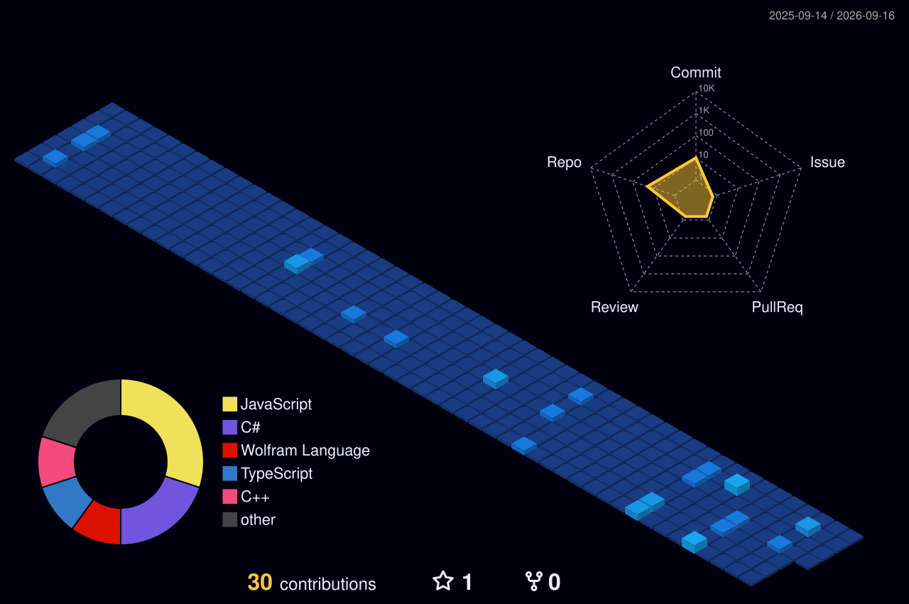

  <!-- Header Banner -->
  

  <!-- Typing SVG Animation -->
  

  <!-- Cat Typing Pet Widget -->
  

    
  

  <!-- Social Badges -->
  

    
    
    
    
    
  

  

---

### 👤 About Me

<table>
  <tr>
    <td width="35%" align="center" valign="middle">
      
    </td>
    <td width="65%" valign="top">
      <h3>🚀 Hi there! I'm Krisna Bagus Riyatno 👋</h3>
      

        I am a dedicated <b>Vocational High School Student</b> specializing in <b>Software Engineering and Web Development</b> at <b>Enuma Tech</b>. I have a passion for designing interactive, clean, and efficient web applications.
      

      

      <ul>
        <li>💼 <b>Current Role:</b> Student & Web Developer @ Enuma Tech</li>
        <li>📍 <b>Location:</b> Central UNS (Kentingan, Jl. Ir. Sutami No.36A, Jebres, Surakarta, Jawa Tengah 57126)</li>
        <li>⏰ <b>Timezone:</b> UTC -12:00</li>
        <li>🎯 <b>Interests:</b> Full-Stack Development, Modern UI/UX Design, Cyber Security & Open Source</li>
      </ul>
    </td>
  </tr>
</table>

---

### ⚽ Highlights & Special Moments

  <table>
    <tr>
      <td align="center" width="100%">
        
         
        <b>🐐 Once in a Lifetime Moment: Hanging out with CR7 (Cristiano Ronaldo)!</b>
      </td>
    </tr>
  </table>

---

### 🏆 GitHub Achievements & Profile Summary

  

---

### 🛠️ Tech Stack & Technologies (3D & Isometric Badges)

#### 🌐 Languages & Frontend Development

  
  
  
  
  

#### ⚙️ Backend, Database & Tools

  
  
  
  
  

---

### 🐍 Contribution Eating Snake Animation

> Automatically rendered via GitHub Actions ([`.github/workflows/snake.yml`](.github/workflows/snake.yml))

  

---

### 🧱 3D Contribution Calendar & Isometric Visualizer

> Automatically generated daily via GitHub Actions ([`.github/workflows/profile-3d.yml`](.github/workflows/profile-3d.yml) & [`.github/workflows/metrics.yml`](.github/workflows/metrics.yml))

  
<b>🌆 3D Isometric Profile Contribution Graph</b>

  
  
    
  
  
<b>📊 Low-Poly Isometric Metrics & Language Breakdown</b>

  

---

### 📈 Real-Time Activity Graph & Coding Habits

  

---

### 📊 GitHub Analytics & Streak Stats (Fixed Endpoints)

  <table border="0">
    <tr>
      <td>
        
      </td>
      <td>
        
      </td>
    </tr>
  </table>
  
   
  
  <!-- Fixed Streak Stats Endpoint using Demolab Mirror -->
  

---

### 📬 Connect With Me

| Platform | Link |
| :--- | :--- |
| 📧 **Email** | [bagusganteng2443451@gmail.com](mailto:bagusganteng2443451@gmail.com) |
| 💼 **LinkedIn** | [linkedin.com/in/krisna-bagus-70a439378](https://www.linkedin.com/in/krisna-bagus-70a439378/) |
| 🐦 **X (Twitter)** | [@RaptorCF1](https://x.com/RaptorCF1) |
| 🎥 **YouTube** | [@RaptorOfficial-b5p](https://www.youtube.com/@RaptorOfficial-b5p) |
| 🎵 **TikTok** | [@.official0194](https://tiktok.com/@.official0194) |

 

  
  
  <i>Designed with ❤️ for Krisna Bagus Riyatno's GitHub Profile</i>

